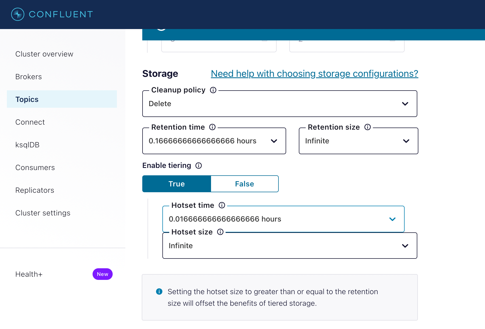
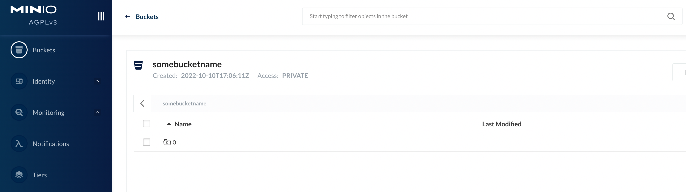
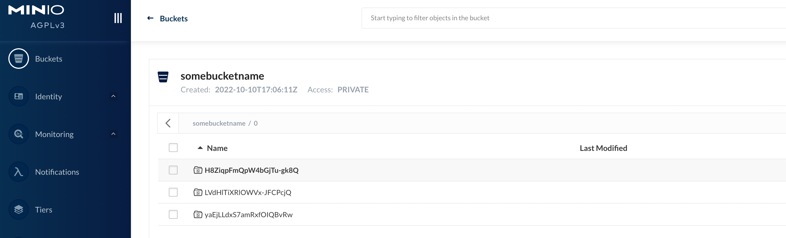
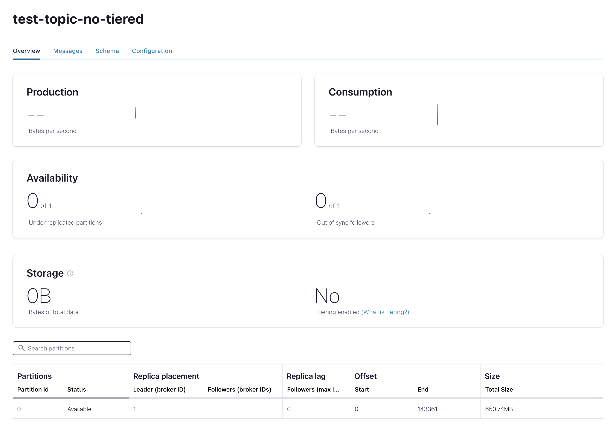
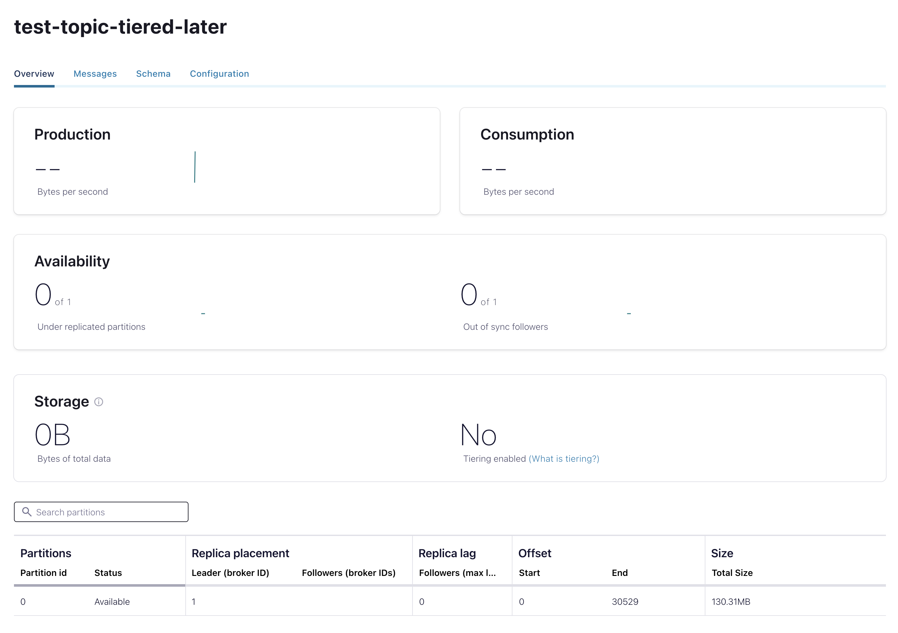
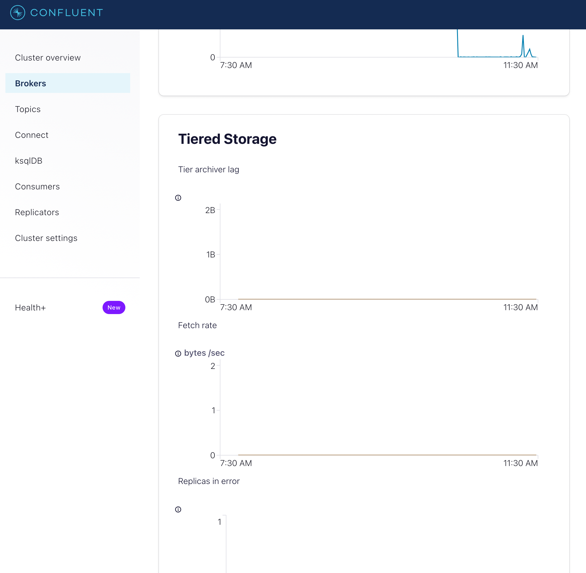

# Tiered Storage Demo

This demo walks through how to get started with Tiered Storage in Confluent Platform. We are using minio, so no cloud access is needed for this demo.

For more information:

* [Link to documentation](https://docs.confluent.io/current/kafka/tiered-storage.html)

## Requirements
- Docker must be installed and running.

## Run the Demo

### Start a Broker with Tiered Storage Enabled

1. Run docker compose
```shell 
docker-compose up
# or if you'd like to hide the output and run in the background
docker-compose up -d
```
2. Confluent Control Center will be available at http://localhost:9021 (no password)
3. Minio console will be available at http://localhost:9001/ (check docker-compose.yml to see the password)

## Create topics

To observe the results of the demo within a reasonable time frame, we create a topic with a short hotset (1 minute), a short retention period (10 minutes), and smaller log segments (10 MB). These configurations were passed to the broker through the [docker-compose.yml](docker-compose.yml) file. Messages that are produced to this topic will be uploaded to the specified S3 bucket.

* `test-topic-no-tiered` will not have the tiered storage enabled
* `test-topic-tiered` will have tiered storage enabled when created
* `test-topic-tiered-later` will be created without tiered storage and then enabled it later on

```shell
 kafka-topics \
    --bootstrap-server localhost:9091 \
    --create \
    --topic test-topic-no-tiered \
    --partitions 1
kafka-topics \
    --bootstrap-server localhost:9091 \
    --create \
    --topic test-topic-tiered-later \
    --partitions 1
kafka-topics \
    --bootstrap-server localhost:9091 \
    --create \
    --topic test-topic-tiered \
    --config confluent.tier.enable=true \
    --partitions 1
```

Additionally, you can create a topic through Confluent Control Center and configure Tiered Storage from there.

<kbd></kbd>

## Produce Messages to the Topic


### Tiered topic
After creating the topic, we should produce enough messages to the topic to ensure that log segments will fill to the 10MB limit and be uploaded to the S3 bucket.

```shell
kafka-producer-perf-test --topic test-topic-tiered \
    --num-records 5000000 \
    --record-size 5000 \
    --throughput -1 \
    --producer-props \
        acks=all \
        bootstrap.servers=localhost:9091 \
        batch.size=8196
```
After a short wait, we should see files beginning to appear in the S3 bucket. You may notice the top directory of "0" appearing first.

<kbd></kbd>

Navigating into the directory, we should see more sub-directories that each correspond to a specific log segment:

<kbd></kbd>

### Non tiered topic

After creating the topic, we should produce enough messages to the topic to ensure that log segments will fill to the 10MB limit and check nothing is uploaded to the tiered storage.

```shell
kafka-producer-perf-test --topic test-topic-no-tiered \
    --num-records 5000000 \
    --record-size 5000 \
    --throughput -1 \
    --producer-props \
        acks=all \
        bootstrap.servers=localhost:9091 \
        batch.size=8196
```
After a short wait, we should C3 showing data is there, but tiered is disabled.

<kbd></kbd>

### Tiered topic later

We will divide this example on pieces, first one, we produce to the topic without tiered storage enabled.

```shell
kafka-producer-perf-test --topic test-topic-tiered-later \
    --num-records 50000 \
    --record-size 5000 \
    --throughput -1 \
    --producer-props \
        acks=all \
        bootstrap.servers=localhost:9091 \
        batch.size=8196
```

We confirm no data is sent to tiered storage.

<kbd></kbd>

*Enabling tiered storage*

Execute

```shell
kafka-configs \
    --bootstrap-server localhost:9091 \
    --entity-type topics \
    --entity-name test-topic-tiered-later \
    --alter --add-config confluent.tier.enable=true
```

We produce again and we can see data going to the minio

```shell
kafka-producer-perf-test --topic test-topic-tiered-later \
    --num-records 50000 \
    --record-size 5000 \
    --throughput -1 \
    --producer-props \
        acks=all \
        bootstrap.servers=localhost:9091 \
        batch.size=8196
```

## Consume Messages

Because the topic has a short hotset period, log segments that are uploaded to the S3 bucket will not remain on disk for long. The log segments with the earliest offsets will start to be deleted from disk, since a copy of them resides in object storage. We can still consume these messages that now reside only in the S3 bucket. We can create a consumer that is configured to read messages from the beginning of the topic:

```
kafka-consumer-perf-test --topic multi-region-async \
    --messages 5000 \
    --threads 1 \
    --broker-list localhost:9091 \
    --timeout 20000 \
    --consumer.config config/consumer.config
```

## Monitoring Tiered Storage

It is likely that there is no obvious difference between reading messages delivered from the S3 bucket versus reading messages from log segments on disk. We can query metrics from the broker to verify that the consumer was reading messages delivered from the broker.

You can monitor various Tiered Storage metrics through the C3 dashboard

<kbd></kbd>

## shutdown

```shell
    docker-compose down -v
```